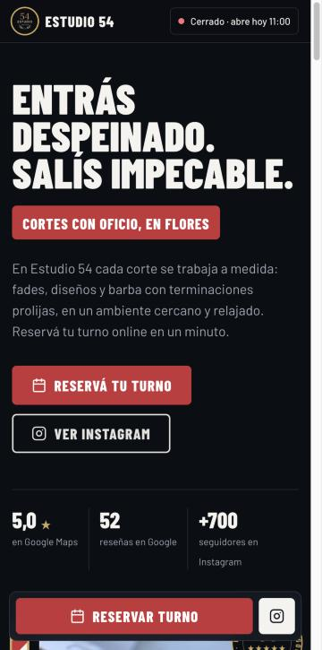
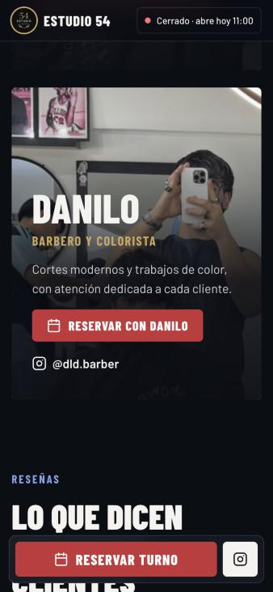

<div align="center">


# Estudio 54

**Propuesta de página web · Barbería y peluquería en Flores, CABA**

</div>

---

## La idea

Hoy la información de Estudio 54 está repartida en varios lugares: los precios y turnos en Fresha, la dirección y las reseñas en Google Maps, y los videos en Instagram. Quien quiere cortarse el pelo tiene que saltar de una app a otra.

Esta propuesta junta **todo en una sola página**, pensada para verse bien en el celular y para que reservar sea lo más fácil posible.

<div align="center">

&nbsp;&nbsp;&nbsp;

</div>

## Qué incluye

- ✂️ **Servicios y precios**: corte básico, corte + diseño y corte + barba, cada uno con su foto y su botón de reserva.
- 💈 **El equipo**: Gonzalo y Danilo, cada uno con un botón para **reservar directamente con él** y su Instagram.
- ⭐ **Reseñas**: el 5,0 de Google y lo que dicen los clientes.
- 🎬 **Videos**: los reels del estudio, en un carrusel para deslizar.
- 🕐 **Horarios en vivo**: la página indica si el estudio está **abierto, en pausa o cerrado** en este momento y cuándo vuelve a abrir.
- 📍 **Ubicación**: dirección, mapa y botón para llegar con Google Maps.
- 📅 **Reserva siempre a mano**: en el celular, el botón "Reservar turno" queda fijo abajo de la pantalla.

Las reservas se siguen haciendo por **Fresha**, como hasta ahora: la página solo hace que lleguen más rápido.

## Cómo verla

Abrí el archivo **[`v4/estudio54-landing-v4.html`](v4/estudio54-landing-v4.html)** (descargalo con el botón *Download raw file*):

- **En la computadora:** doble clic y se abre en el navegador.
- **En iPhone:** guardalo en la app *Archivos*, mantenelo apretado → *Compartir* → *Safari*.
- **En Android:** abrilo desde *Descargas* y elegí *Chrome*.

Hace falta conexión a internet para el mapa y las tipografías.

## Próximos pasos

1. Revisar textos, precios y fotos, y ajustar lo que haga falta.
2. Sumar fotos en alta calidad de los cortes y del estudio.
3. Publicarla con un dominio propio (por ejemplo, `estudio54.com.ar`) y poner el link en la bio de Instagram y en Google Maps.

---

<details>
<summary><b>Notas técnicas</b></summary>

### Versiones

| Carpeta | Descripción |
|---|---|
| `v1/` | Primera versión: negro, crema y dorado, tono descontracturado. |
| `v2/` | Estructura nueva con estilo barbería: rojo, blanco y azul, tipografía de cartel y poste animado. |
| `v3/` | Estilo de la v1 con el contenido y las reglas de la v2. |
| `v4/` | **Versión actual.** Combina v1 y v2 con un sistema de diseño fijo (ver [`v4/DISENO.md`](v4/DISENO.md)). |

Cada carpeta tiene:
- `index.html` + `assets/`: versión editable.
- `estudio54-landing*.html`: archivo único con las imágenes embebidas, para compartir y abrir directo en el navegador.

### Ver localmente

```bash
python3 -m http.server 5454
```

Y abrir `http://localhost:5454/v4/`.

### Cómo editar la v4

La v4 se genera a partir de una plantilla y un archivo de datos:

| Archivo | Qué contiene |
|---|---|
| `v4/datos.json` | **Única fuente** de datos del negocio: links, dirección, IDs de Fresha de cada barbero, horarios, servicios con precio y preguntas frecuentes. |
| `v4/src/index.html` | Plantilla de la página (textos, estructura y estilos). |
| `v4/build.py` | Genera `index.html`, `estudio54-landing-v4.html`, los datos estructurados, `llms.txt` y, si hay dominio, `robots.txt` y `sitemap.xml`. |
| `v4/PENDIENTES.md` | Lo que falta de SEO y depende del estudio o de la publicación. |

Después de editar `datos.json` o `src/index.html`:

```bash
cd v4
python3 build.py
```

No edites `v4/index.html` ni `v4/estudio54-landing-v4.html` a mano: se sobrescriben en cada build.

#### Qué archivo usar
- **Para publicar en un hosting:** `index.html` + `assets/`. Las imágenes se cargan aparte y de forma diferida, así la página abre más rápido.
- **Para mandar por WhatsApp o mail:** `estudio54-landing-v4.html`, que tiene todo adentro. Pesa unos 650 KB porque las imágenes van embebidas.

#### Vista previa al compartir el link
Las etiquetas Open Graph de título y descripción ya están. Para que WhatsApp muestre también la imagen, completá `sitio.url` en `datos.json` con la URL pública y volvé a correr el build.

### Datos

Reseñas, puntuación y seguidores están cargados a mano en la plantilla. Precios, horarios y preguntas frecuentes están en `datos.json`. Con los horarios se arma la semana visible y se calcula el estado abierto/pausa/cerrado, que se actualiza cada minuto con la hora de Buenos Aires.

Los links "Reservar con Gonzalo/Danilo" usan el `employee_id` interno de Fresha. Si un barbero se da de baja o se vuelve a registrar, hay que actualizar su ID en `datos.json` (ver la nota en ese archivo).

</details>
